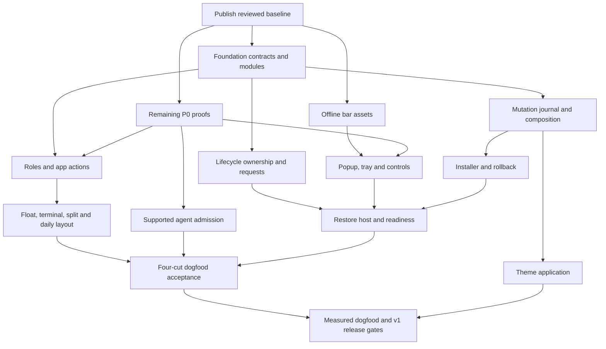

# Sol build dispatch

Reader: the Sol build lead, Astra reviewers and any Sol helper receiving a bounded lane. Prepared 2026-09-16; planning only. No implementation or machine cutover starts from reading this file.

Start at [NEXT](../NEXT.md). [DESIGN](../../../DESIGN.md) and its [contract annex](../build-contracts.md) own behavior; P0–P5 own scope; [TODO](../../../TODO.md) owns completion; execution-state.json owns active work and evidence. These work orders refine those sources rather than add another status ledger.

## Baseline and publication

The inspected clean source checkpoint was `1f47d497069b69a627f9b8c8598d21b4b55f4aa9` on local main, development version 0.1.8. Read-only `git ls-remote --heads origin main` returned `ff91369b11e8ce6f51e913954613ce93d1a94d55`: local main was 52 commits ahead. The handoff's `8ec83dc`/51 count predates its own documentation commit. This planning pass is on `docs/v1-sol-build-plans`; these counts are observations, not a permanent publication claim.

Before implementation fan-out, reconcile this docs branch and publish the reviewed current baseline to the Winmakase repository. Publication is a build prerequisite, not authorized by this planning pass. Recheck the remote tip, repository/authorship and outgoing diff; do not force-push. A docs branch based on 52 unpublished commits does not make those commits a small documentation PR. Publish the existing baseline transparently, then review/merge the planning delta against it. Record the resulting full remote commit in the first instantiated handoffs.

Every later builder branches from a named accepted remote commit. Never use this document's old source checkpoint as the merge base once dependencies have merged. Verify clean/owned worktrees with Wire; start each builder in its actual worktree with instructions/access/identity checked. The planning session's client remains in Friday and accesses this repository explicitly; a build session should open the Winmakase root directly.

## Operating model

| Owner | Responsibility |
|---|---|
| Sol lead, high effort | Normal implementation, integration, acceptance and the single ledger writer after contracts are frozen |
| Sol helper, high effort | A second slice only when saving wall time matters and its write set and dependencies are independent |
| Astra | Disputed shared contracts, paired Glaze decisions and fresh review of identity/window/lifecycle/privileged/release changes |
| Fresh Sol reviewer | Ordinary UI/rendering review when the change is too broad for lead self-review |
| Chris | Product taste, physical input, prepared daily-machine cutover, external publication and final release decisions |

The completed Astra planning pass is the contract pass. Do not retain Astra as a standing narrator while a Sol builder rereads the same material. One top-level Sol should build and integrate by default. Use native agents only for a second independent lane or a fresh review. Follow up with the same builder for repairs and one adjacent slice in the same package. No nested delegation or new orchestrator service. Chris does not carry prompts between workers.

Fresh workers start without conversation history. Their prompt names this work order, exact contract sections, base commit, owned paths, acceptance cases and stopping point. They do not reread the planning transcript, every plan or unrelated evidence. A return stays compact: base and commits, behavior/files, commands/results, evidence, risks and next dependency. The diff and evidence hold the detail.

Review depth follows risk:

| Risk | Required review |
|---|---|
| Input hooks, window identity/ownership, paired Glaze, lifecycle authority, privileged install/rollback, release | Fresh Astra review of requirements, diff and evidence |
| Broad UI/rendering, focus/provider behavior, installer UX | Fresh Sol review unless the lead escalates a contract question to Astra |
| Mechanical asset, fixture, documentation or deterministic renderer change | Sol lead self-review plus applicable checks; no fresh agent by default |

A fresh reviewer gets requirements, diff and actual evidence without the builder's suggested verdict. The lead integrates through a reviewable feature PR and reruns affected composition checks.

One implementation lane is the token-efficient default. At most two may run when elapsed time matters. Do not open a third lane for Glaze ports; a port occupies an available builder slot or waits. Guest experiments serialize under `env:winmakase-uat`. Code parallelism does not authorize two owners of the same desktop. At handoff release the environment only after cleanup and state capture.

Builders own their implementation paths and a slice-specific evidence directory. The lead alone edits NEXT, execution-state.json, TODO, DESIGN/annex, shared package manifests/lockfiles, changelog and progress at integration, unless a handoff explicitly transfers a shared file to one builder. Workers return proposed documentation deltas. A slice touching `main.rs`, `lib.rs`, `config.rs`, keymap `lib.rs`, supervisor or package locks is not independent of another writer of that file merely because the features differ.

Use the existing [handoff template](../handoff-template.md). Fill actual base hash, worktree, owned paths, imported interface versions, requirement/case IDs, requested and observed model, allowed tests and stopping point before dispatch. No blank base/dependency fields in an active handoff. New modules listed below are proposed paths, not claims that APIs already exist.

## Dependency order

The four dogfood cuts are acceptance milestones. They are not four monolithic branches and do not force all source work to wait for physical input.

Arrows from P0 mean the relevant proof, not all of R0. Offline assets need no Caps proof. Pure lifecycle tests need no popup visuals. Privileged-layout/install staging is required before testing elevated restoration; full installer acceptance follows integrated lifecycle. Themes need the journal and preserved reload, not a retired taskbar.

| Wave | Slot A | Slot B | Lead/review gate |
|---|---|---|---|
| 0 | F0 shared type/module foundation | S0 offline assets | Freeze interface fixtures; reconcile/publicize baseline before dispatch |
| 1 | W0 role identity proof/schema | L0 singleton/requests | Lead schedules I2 and remaining popup/admission/native probes one at a time |
| 2 | W1 focus-or-launch/new | J0 journal/composition | Shared runtime/keymap entry files belong to only one writer per handoff |
| 3 | W2 float/terminal/split | S1 popup/provider proof and host | W1 and popup proof accepted before dependent wiring |
| 4 | W3 daily layout/adoption/restart | S2 tray/calendar/controls | Lead owns any paired Glaze capability change |
| 5 | G0 supported agent admission | INST0 protected payload/install staging | Relevant A proofs; journal/protected manifest prerequisite |
| 6 | L1 state machine/restore host | T0 palette/preset rendering | Freeze health snapshot before S3 integration |
| 7 | S3 monitor/status composition | INST1 update/repair/uninstall | L1/journal ownership integrated; serialize shared installer edits |
| 8 | T1 theme application and UI | Remaining isolated cut evidence | S3/INST1 integrated before recovery takeover proof; S2 transfers theme view |
| 9 | REL0 dogfood/release evidence | Optional bounded Glaze upstream port | Cutover only when prepared evidence and Chris's decision exist |

Waves are a safe dependency schedule, not a command to run two agents. For token efficiency, execute Slot A and Slot B sequentially unless the lead deliberately trades more tokens for less elapsed time. The lead may pull a ready independent slice forward, including pure L1 reducer work, after checking actual files and accepted dependencies. It must not let a builder code against an unproved popup/identity/admission capability. If two nominal lanes need the same file, integrate the first or transfer that file; do not resolve concurrent design by cherry-pick roulette.

## Work orders and coverage

| Work order | Slice IDs | Existing requirements retained |
|---|---|---|
| [Foundation and proofs](foundation.md) | F0, I2, P0 remainder | P0 provenance/performance/bindings/classification/profile/popup/A1–A4/appearance/suppression/guard/pressure |
| [Window loop](windows.md) | W0–W3, G0 | All P1 sections; W3 float recovery, W4 layout, W5 deferred measured verdict |
| [Visible shell](shell.md) | S0–S3 | All P2 changes and every taskbar replacement row |
| [Lifecycle and installation](lifecycle-install.md) | J0, L0–L1, INST0–INST1 | P4 A–D; P5 items 1–8 and R4/R5 failure matrices |
| [Appearance and release](appearance-release.md) | T0–T1, REL0 | All P3; P5 documentation/distribution/R6; upstream and future boundary |

## Return, review and acceptance

A return names base and commits, actual changed files/behavior, commands and counts, environment/build hashes, case-level artifacts, unverified/failing cases, remaining risk and next dependency. Target 300 words unless a failure needs more evidence. An unresolved required case means implementation complete / acceptance pending, never accepted. Test stubs and mocks cannot close Windows behavior gates.

Run changed-crate tests plus applicable integration tests; full required Windows CI at integration/release. The existing CI's `continue-on-error` ignored desktop run is diagnostic, not R4/R5 acceptance. Record baseline lint failures explicitly and resolve or scope them before release. Avoid needless whole-workspace reruns after unrelated documentation-only corrections.

After two failed repair/review cycles or a disproved premise, reuse the expert with the new evidence and re-derive the mechanism. Do not reset the counter with another commit. At each acceptance update evidence, contract changes, changelog, execution-state and NEXT, then regenerate progress. Keep every P/R gate unchecked until its required cases pass.

Check in after two accepted slices, a package boundary or 60–90 active minutes. Show behavior/evidence and the next slice; ask only decisions that belong to Chris. Continue independent authorized work. No automatic new top-level sessions, no new explicit goal unless requested, and no messages to external people as part of orchestration.

## Dogfood versus release

Cut 1 closes selected input plus Run context; Cut 2 closes the daily window loop for declared supported classes; Cut 3 closes offline controls and native fallback; Cut 4 closes lifecycle/install/rollback. All applicable blocking defects still block daily cutover. Taskbar suppression stays disabled when its proof is incomplete; the outstanding v1 retirement requirement remains open.

After those cuts, Chris may select the default daily session and authorize a named dogfood prerelease. Appearance completion and remaining P/R cases still gate public v1. Public release requires real elapsed stability/switcher evidence and fresh release review. Do not make an old statement forbidding every tag conflict with the handoff's dogfood prerelease milestone.
