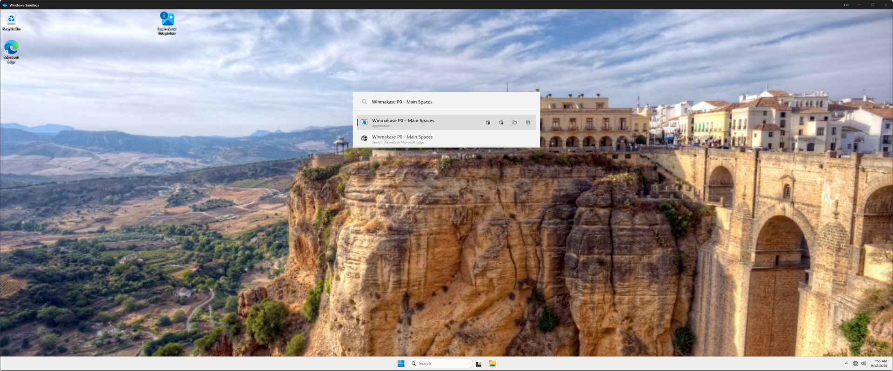

# P0 guest runtime evidence — 2026-09-12

Status: bounded launcher checks passed; dialog/reload failures reproduced; ancestry prototype accepted and integrated. R0 remains open; no daily-stack cutover occurred.

## Environment and prerequisites

The lead rebuilt Glaze `dd8fb7d515eb73c7dc1210076922e75c742bb702` with the command and hashes in [direct-caps-build.json](direct-caps-build.json). All three release binaries built successfully. PowerToys is pinned to `0.100.2`; the installed Run image matches SHA-256 `062ED25AA8F343C83641277111BCCAC366B25EBF80021B1E4D783EEF25D2E688`.

Tests use Windows Sandbox build 26100, one RDP display and software rendering. Default vGPU failed before login with repeated `udwm.dll` crashes. Disabling vGPU produced a usable guest. Networking, clipboard, printer and audio input are disabled. Only fixture source, pinned assets and probe scripts are mapped read-only; an isolated output directory is writable. No host config or secrets are mapped.

The first-start Sandbox app update installed version `0.8.107.0`. An earlier guest/client shutdown sequence crashed the host service and temporarily left an orphaned test VM. Windows released it before administrator cleanup was needed. The current replacement guest is separate; no host service or daily-stack process was terminated.

PowerToys installed offline. In this setup its runner ignored the settings file written with PowerShell 5.1's UTF-8 BOM; writing UTF-8 without a BOM enabled Run. New-install defaults enabled Command Palette and disabled Run. The guest test enables only Run.

The clean guest lacked `VCRUNTIME140.dll`; Glaze displayed a loader error. A locally installed Microsoft-signed redistribution package was copied into the read-only assets and installed only in the guest: file version `14.51.36247.0`, 18,731,856 bytes, SHA-256 `843068991DAAA1F73AD9F6239BCE4D0F6A07A51F18C37EA2A867E9BECA71295C`. Source was the Visual Studio `VC/Redist/MSVC/14.51.36231` folder; the file's version is authoritative. Installer log records exit `0x0`, no restart, after approximately 244 seconds; the observer's initial 90-second deadline expired while installation continued. Glaze then started and answered a workspace query. This runtime belongs in the future package prerequisites. [Microsoft redistribution compatibility](https://learn.microsoft.com/en-us/cpp/windows/latest-supported-vc-redist?view=msvc-170)

## Launcher observations

- Signalling the pinned Run activation event showed one launcher and focused its UIA `Query` editor. Repeating the event while open hid it. The event is a toggle; a future explicit-open command must observe visibility/focus and avoid blindly toggling.
- Four separate Start Menu shortcuts target one fixture executable. Searches found distinct application results; invoking each produced the exact checked-in argument array. Verified labels include `Work Profile`, `Owner Dialog`, `Café 東京` and `Tools Pop-up`.
- The first search immediately after publication found only web search. Restarting Run populated the shortcuts. This proves restart reindexing, not the timing or reliability of live index refresh.
- After renaming the main shortcut and removing the utility shortcut, restarting Run found the renamed application and omitted application results for the old name and removed utility. Only web-search results remained for those two queries. The shortcuts were restored afterward.
- Thirty warm event activations reached one visible, uncloaked launcher with foreground and UIA query focus: 30/30 passed, p95 **54.78 ms**, maximum **58.05 ms**. Timing includes repeated native/UIA observation and excludes launching the observer. These samples were taken before Glaze started, on the same warm Run process. They do not measure physical Caps, cold process/OS startup or other display contexts.
- Five complete PowerToys runner/Run process restarts reached the focused query editor in **2.28–2.83 seconds**, median **2.31 seconds**. These include runner launch, waiting for the event, activation and observation, with warm OS/file caches and the fixture Glaze running. They measure process startup, not cold boot or catalog readiness. Raw samples are retained separately.

Raw fixture captures, UIA result lists and activation samples are retained in `evidence/`; guarded guest probe scripts are in `probes/`. This is test infrastructure, not a production launcher implementation.

## Open acceptance

No-console-flash event capture, key/bar integration, repeated explicit-open behavior, focused-monitor placement, fullscreen/elevated applications, real GPU/mixed-DPI displays and physical Caps remain open. [Dialog failures](dialog-runtime.md) and the [reviewed ancestry prototype](../2026-09-12-agent-proof/README.md) are separate results. The broader popup, tray/calendar, split, background-input, recovery and R0 gates are unchanged.
