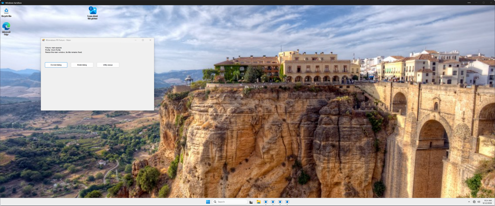
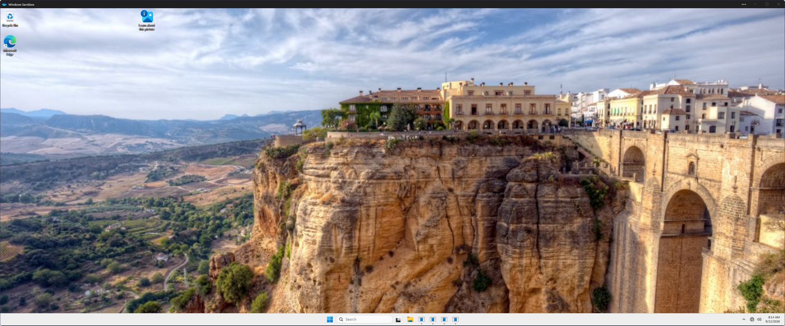

# D1 guest classification and reload result

**Failure reproduced on Glaze `dd8fb7d`.** The fixtures and native capture work; the current broad home rule violates the target dialog and reload contracts. No production policy fix is included in this batch.

The guest policy in [glaze-fixture.yaml](probes/glaze-fixture.yaml) ignores other processes and applies `move --workspace 1` plus `set-tiling` on Manage to the fixture process. This deliberately reproduces the current renderer's broad home-rule shape. It is not a claim that stock Glaze tiles fixed dialogs without that rule.

The fixture implementation was reviewed through worker commit `16af7d6` and integrated as `d21584f`. Both PowerShell versions passed 72 assertions; the lead's integration run also passed. Guest runtime caught a single-role array bug and a GUI process-result wait bug; fresh review then caught an inherited-pipe timeout gap. All three are fixed. The probe records exact process/window lifetimes and brackets Glaze queries with native checks.

## Initial state

All four action captures succeeded after installing the pinned C++ runtime.

| Fixture window | Native facts | Glaze result under broad home rule |
|---|---|---|
| Main | Unowned, resizable | Tiled, workspace 1 |
| Owned modeless dialog | Owner is its fixture main; non-resizable | Tiled; previous state floating |
| Modal dialog | Owner is its fixture main; non-resizable | Tiled; previous state floating |
| Utility | Owned, non-resizable, tool-window style | Unmanaged |

The utility's absence is recorded explicitly; it does not pass managed-workspace preservation. Application-specific utility behavior remains a policy decision/proof.

## Routine reload

The main-only control was deliberately set to floating at `(250, 200)`, size `700 × 450`, moved to workspace 2 and focused. The same config was then reloaded through `wm-reload-config`.

| Fact | Before reload | After reload |
|---|---|---|
| HWND/process lifetime and Glaze ID | Recorded | Preserved |
| State | Floating | Tiling |
| Workspace | 2 | 1 |
| Geometry | 250, 200; 700 × 450 | 2543, 8; 499 × 1172 |
| Display/focus | Shown, focused | Hidden, unfocused |

The comparison fails state, workspace, geometry, parent, display and focus preservation while confirming identity continuity. The window disappears from the active workspace because reload replays its home rule. This is a placement change to the same live window, not destruction/recreation.

## Owner hidden on another workspace

An additional bounded probe closed only the registered modeless dialog, moved its still-live main to workspace 2 and kept workspace 1 active. UIA discovery from the hidden main returned no matching button. A previously inspected native child HWND, revalidated by PID, parent and exact button text, accepted `BM_CLICK` and created a new owned dialog with window generation 3. No global keyboard/mouse input was injected.

The new dialog had a valid owner and visible style but no Glaze representation in either the immediate or later settled capture. This does not pass parent-workspace placement or general background automation. Full cloaked capture/input behavior needs A3; retained native button handles are not a general solution for browser or CUA workflows.

## Disposition

Implement the bounded owner/resizability facts and preserve/auto rule state described in the [D1 source report](../2026-09-12-dialog-proof/report.md), prevent routine Manage replay, and rerun the same captures. New owned-window placement must resolve the owner's workspace. Real login/settings/Viscosity, hidden-parent modal behavior and the broader app matrix remain unrun. P1/R0 are not passed by reproducing these failures.
